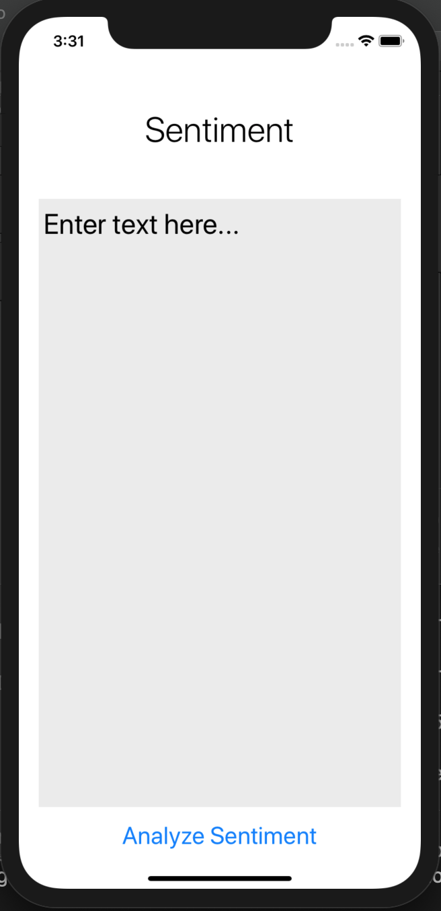
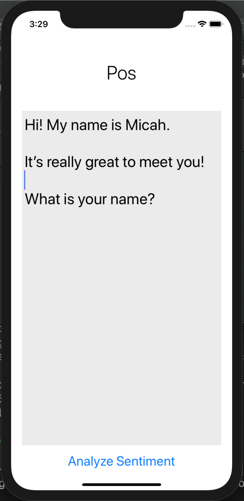
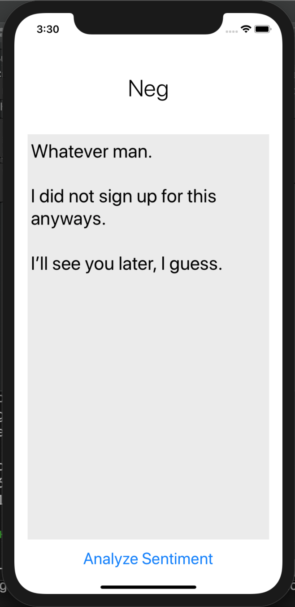

# CreditCardFraudDetector
Python script that uses Kaggle's credit card transaction dataset to detect future fraudulent credit card transactions.

# Technology

**Built with**
  * Swift 5.0
  * XCode 10.1
  * [TensorFlow](https://www.tensorflow.org/, "TF")
  * [CoreML](https://developer.apple.com/documentation/coreml, "CoreML")

# Demo # 

## Installation ## 

1. Clone the repository.
2. Open in XCode 10.1 or later.
3. Build and run project on an iPhone device.

## Support ## 

If you find any of my projects helpful/inspiring and would like to support me, please do so [here](https://venmo.com/Micah-Yong "Venmo")
Feel free to raise issues or suggest improvements. My email is micahtyong@berkeley.com!

